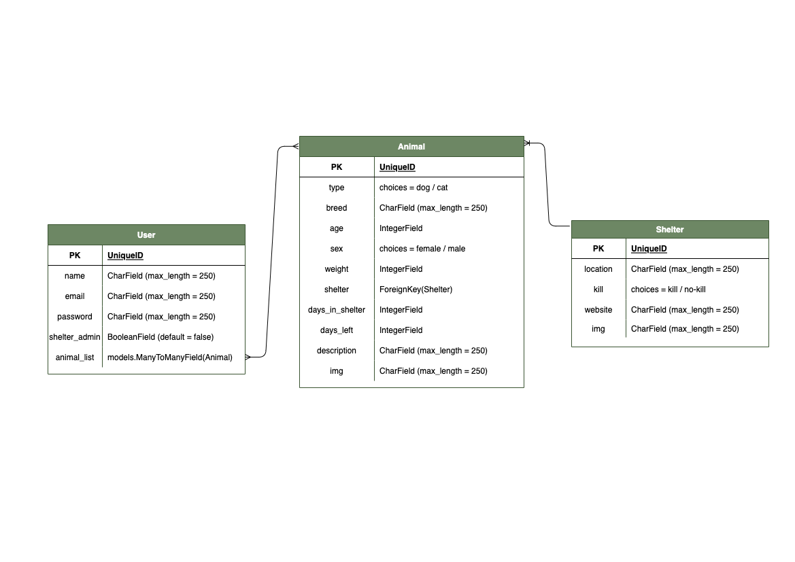
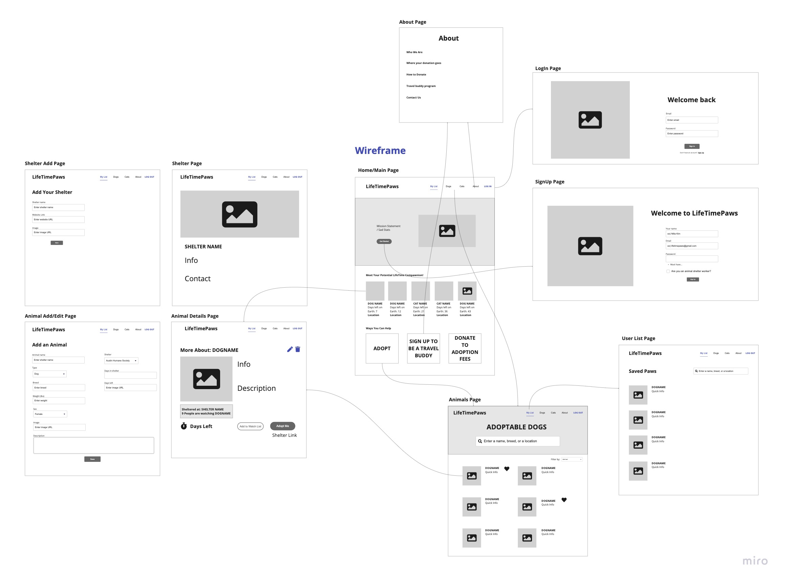

# LifeTimePaws

LifeTimePaws is a centralized platform for publicizing animals that need urgent adoptions from shelters all across the country. LTP provides a way for a shelter to gain more site traffic outside their local region, increasing  adoption chances for animals who don't have much time left in the shelter.  

 

## Table of Contents
[Get Started](https://github.com/skim121/LifeTimePaws/#get-started) 
|
[Brainstorming](https://github.com/skim121/LifeTimePaws/#brainstorming) 
|
[Technologies Used](https://github.com/skim121/LifeTimePaws/#technologies-used)
|
[Highlights](https://github.com/skim121/LifeTimePaws/#highlights)
|
[Unsolved Problems](https://github.com/skim121/LifeTimePaws/#unsolved-problems)
|
[Future Enhancements](https://github.com/skim121/LifeTimePaws/#future-enhancements)

## Get Started
See deployed site here: [Heroku Link](https://lifetimepaws.herokuapp.com/)

## Brainstorming

### User Story
- As a User (AAU), I want to register on the register page using email and password
- AAU, I want to  view animals and their details
- AAU, I want to add certain animals to my watch list
- AAU, I want to know which shelter to contact for adopting certain animals
- AAU, I want to be informed to contact admin if I am associated with the shelter
- AAU who is verified as a shelter worker, I want to create my shelter
- AAU who is verified as a shelter worker, I want to add urgent adoption need animals
- AAU who is verified as a shelter worker, I want to delete the animals that are no longer available for adoption
- AAU who is verified as a shelter worker, I want to edit the animal details

### Data ERD 

### Wireframe

## Technologies Used:
- Django (Python)
- PostgreSQL
- Bootstrap5 / Crispy Forms
- Cloudinary
- CKEditor

## Highlights:
- Custom user model with auth 
- Cloudinary upload
- Ability to favorite into profile page
- Responsive design

## Unsolved Problems:
- Debugging login directly from signup page 
- Limit CRUD to user's items only 
- Pagination for overflow data 
- Searching with other keywords than name 

## Future Enhancements:
- User password reset 
- Countdown display for due date 
- Adding video and multiple images to animal detail page
- Enhance UI with animations 
- Payment functionality for donations 
